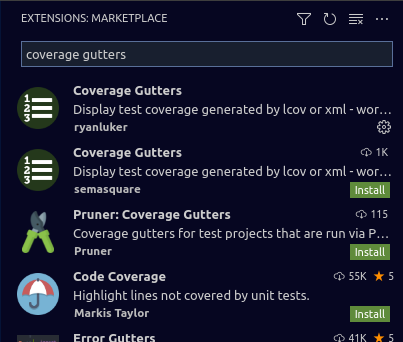
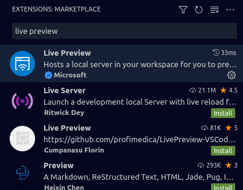
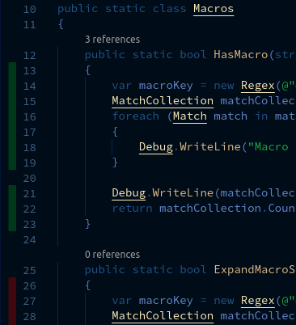
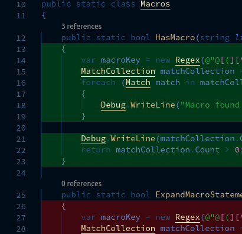

# Quickstart for VSCODE-CODE-COVERAGE

**Summary**:  This is the QUICKSTART.md document to help users get started with the `ryanluker.vscode-coverage-gutters` "*Coverage Gutters*" extension for VS Code.

## Terminology

*Coverage Gutters* depends uses two files.  It's easy to get the files mixed up and we need to make sure that everone is on the same page when we talk about these files.

<details>
<summary>Coverage File</summary>

-----

  * LCOV or XML file containing detailed coverage data

* *Coverage Gutters* supports LCOV, CLOVER, COBERTURA, and JACOCO coverage files

* Generation of the coverage file is language specific and is beyond the scope of this extension.

</details>

<details>
<summary>Coverage Report</summary>

-----

  * HTML file(s) that provides a nice way to view coverage data.

* *Coverage Gutters* does **not** utilize this file.

* Generation of the coverage report is language specific and beyond the scope of this extension.

The extension assumes these two files are located somewhere in your workspace.  There are settings (covered later) to let you customize where **Coverage Gutters** will look for both of these files.

</details>

## Requirements

You need two extensions to get started.  Installation via CLI or Quick Open works best since they use the extension ID to ensure the correct extension is installed.

<details>
<summary>Coverage Gutters - ryanluker.vscode-coverage-gutters</summary>

-----

    1. CLI install

     * `code --install-extension ryanluker.vscode-coverage-gutters`

  2. Quick Open Install

     * `CTRL-P`  `ext install ryanluker.vscode-coverage-gutters`

  3. Install

     * `CTRL-SHIFT-X` to go to Extensions

     * Search for `coverage gutters`

     * Install the extension by `ryanluker`

  

</details>

<details>
<summary>Live Preview - ms-vscode.live-server</summary>

-----

    1. CLI install

     * `code --install-extension ms-vscode.live-server`

  2. Quick Open Install

     * `CTRL-P`  `ext install ms-vscode.live-server`

  3. GUI Install

     * `CTRL-SHIFT-X` to go to Extensions

     * Search for `live preview`

     * Install the extension by `Microsoft`

  

</details>

After the extensions are installed, you need to get your coverage files.

<details>

<summary>Code coverage file</summary>

-----

    1. Support for the following coverage filenames:

     * `lcov.info`
     * `cov.xml`
     * `coverage.xml`
     * `jacoco.xml`
     * `coverage.cobertura.xml`
  
  2. Customizable file name.  You may use any filename you like, but the file must be a Clover, Cobertura, Jacoco, or LCov format file.

  3. Generating a coverage file is language specific.

</details>

## Usage

<details><summary>Generate your coverage file</summary>

-----

  * *How* you generate your coverage file is language specific.

* For example, in .NET the coverage file is generated through unit testing.

</details>

<details><summary>Generate your coverage report</summary>

-----

  * Like the coverage file, generating the HTML report is language specific.

* For example, in .NET there is a  *ReportGenerator* utility.  Other languages may generate the coverage report at the same time as the coverage file.

</details>

<details><summary>Activate code coverage indicators</summary>

-----

  * Pressing `CTRL-SHIFT-7` will colorize the VS Code IDE.  Coloring is transient; when the window becomes hidden it will reset and lose coloring.

</details>

<details><summary>Preview coverage report</summary>

-----

  * Pressing `CTRL-SHIFT-6` will bring up a preview window with the coverage report.

</details>

## Settings

<details><summary>Coverage Base Dir "coverage-gutters.coverageBaseDir"</summary>

-----

  * Directory where the **coverage file** is located.  

* Default is "`**`" which is the entire workspace.  

* To prevent searching through the entire workspace, you can limit **coverage gutters* to a specific folder.

</details>

<details><summary>Coverage File Names "coverage-gutters.coverageFileNames"</summary>

-----

  * JSON array of filenames that are coverage files.

* Default is:

 ```json
 [
    "lcov.info",
    "cov.xml",
    "coverage.xml",
    "jacoco.xml",
    "coverage.cobertura.xml"
]
```

* If your coverage report filename isn't listed, this is where you can add it.

</details>

<details><summary>Coverage Report Filename `coverage-gutters.coverageReportFileName`</summary>

-----

  * Points to the `index.htm[l]` of your coverage report.  The is used for `CTRL-SHIFT-6` Preview Coverage Report function.  Since it's possible to have multiple `index.htm[l]` files in web projects, this should explictly set, e.g. "`coverage/**/index.html`"

</details>

<details><summary>Show Gutter Coverage `coverage-gutters.showGutterCoverage`</summary>

-----

  Enables the Green/Red markings in the gutter to indicate code coverage.

  Default is **Enabled**

  

  This is known to interfere with setting breakpoints from the GUI (clicking on gutters).  Workarounds is to disable this setting and use `coverage-gutters.showLineCoverage`, or press `F9`the default key to set a breakpoint on the current line.

</details>

<details><summary>Show Line Coverage `coverage-gutters.showLineCoverage`</summary>

-----

  Enables the Green/Red markings underneath each line to indicate code coverage.

  Default is **Disabled**

  

</details>

## Troubleshooting

<details><summary>Can't find coverage file</summary>

-----

1. Filename must be:

```text
   lcov.info
   cov.xml
   coverage.xml
   jacoco.xml
   coverage.cobertura.xml
```

   If your coverage file is named something else, you can add it to the list of valid coverage filenamed by editing `coverage-gutters.coverageFileNames`.

2. File must be in `coverage-gutters.coverageBaseDir` which defaults to "`**`" or any directory.

   By default every directory is recursively scanned for a matching filename.  Coverage files can be found faster by pointing this setting to the directory containing the coverage file.  There must be only one matching coverage file within the `coverage-gutters.coverageBaseDir` search folders.

</details>

<details><summary>Preview report not working</summary>

-----

1. File must be named `index.html`

2. Point `coverage-gutters.coverageReportFileName` to the report's index file.

3. Ensure that the `ext install ms-vscode.live-server` extension is installed.

   * `CTRL-P`  `ext install ms-vscode.live-server`

</details>
