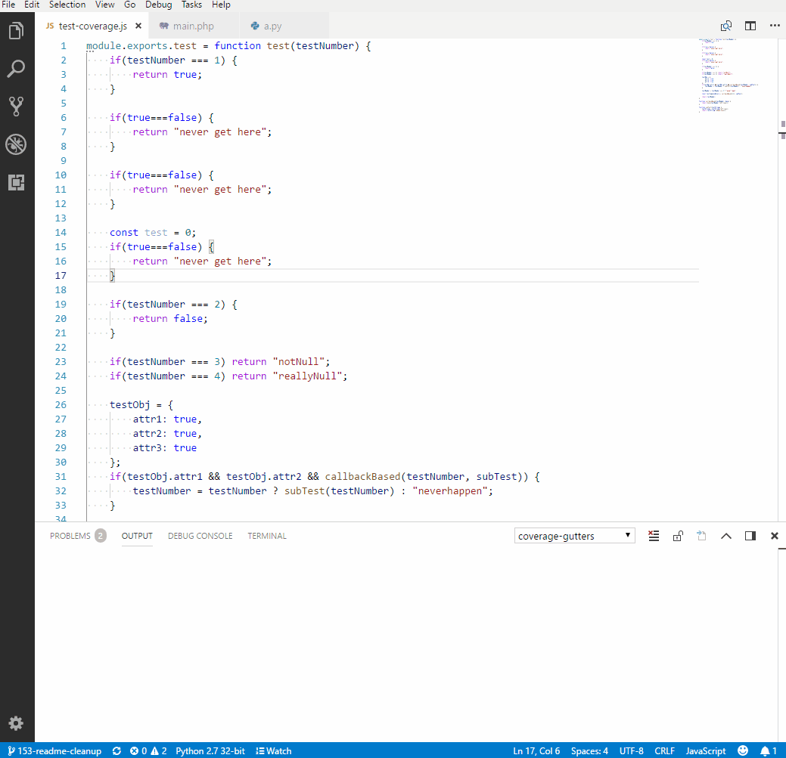

# coverage-gutters

## Features

- Supports any language as long as you can generate an lcov style coverage file
- Extensive logging and insight into operations via the output logs
- Multi coverage file support for both xml and lcov
- Coverage caching layer makes for speedy rendering even in large files
- Relative coverage file resolution for those with complex file paths
- Preview coverage reports inside the editor
- Huge amount of workspace settings to customize the features to your liking
- Colour compatibility with light and dark themes

## Common Commands
**Watch** (activated via command palette or shortcut icon on the status bar):
Activating watch allows the extension to keep track of coverage changes and update it's cache. It also will automatically apply coverage to a file if some exists.

**Display** (activated via command palette or shortcut key):
Displays coverage for the current activate file only, does not update if the coverage files change.

**Preview Report** (activated via command palette):
Shows you a html preview of your coverage reports in your editor.

## Officially Supported Languages (Backed by tests ran nightly)

See [examples directory](example) on how to setup a project.

- [Java](example/java)
- [PHP](example/php)
- [Python](example/python)
- [Nodejs](example/node)

## Tips and Tricks
**Using Breakpoints**: Currently to both use the extension and code debugging breakpoints you need to disable the gutter coverage and enable the line coverage via the settings ( `coverage-gutters.showGutterCoverage` and `coverage-gutters.showLineCoverage` respectively).

## Requirements
- vscode 1.27.0 and up
- macos, linux or windows

## Extension Settings
See extension setting options in IDE.

## Known Issues
### [Open Bugs](https://github.com/ryanluker/vscode-coverage-gutters/issues?q=is%3Aopen+is%3Aissue+label%3Abug)

## Release Notes
### [Changelog](https://github.com/ryanluker/vscode-coverage-gutters/releases)

## Contribution Guidelines
### [Guidelines](/CONTRIBUTING.md)

-----------------------------------------------------------------------------------------------------------

Icon made by <a href="http://www.flaticon.com/authors/dave-gandy" title="Dave Gandy">Dave Gandy</a> from <a href="http://www.flaticon.com" title="Flaticon">www.flaticon.com</a> is licensed by <a href="http://creativecommons.org/licenses/by/3.0/" title="Creative Commons BY 3.0" target="_blank">CC 3.0 BY</a>

