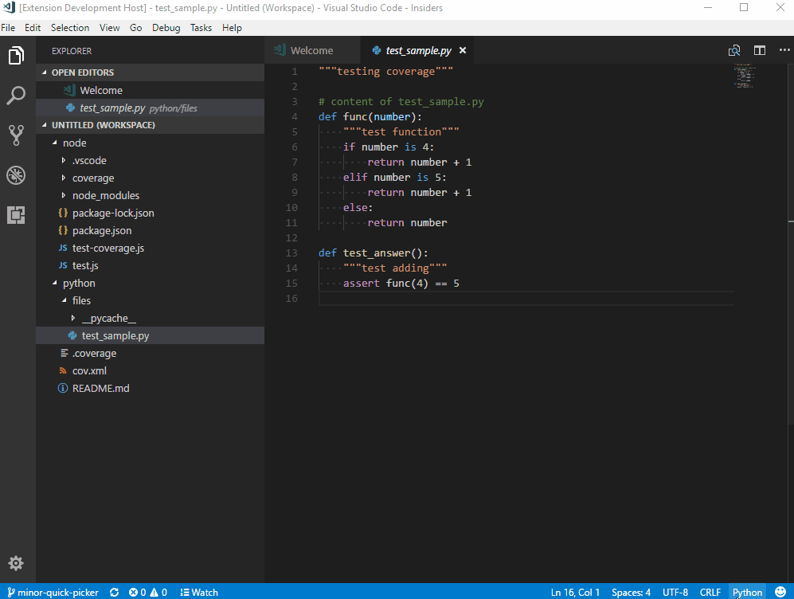
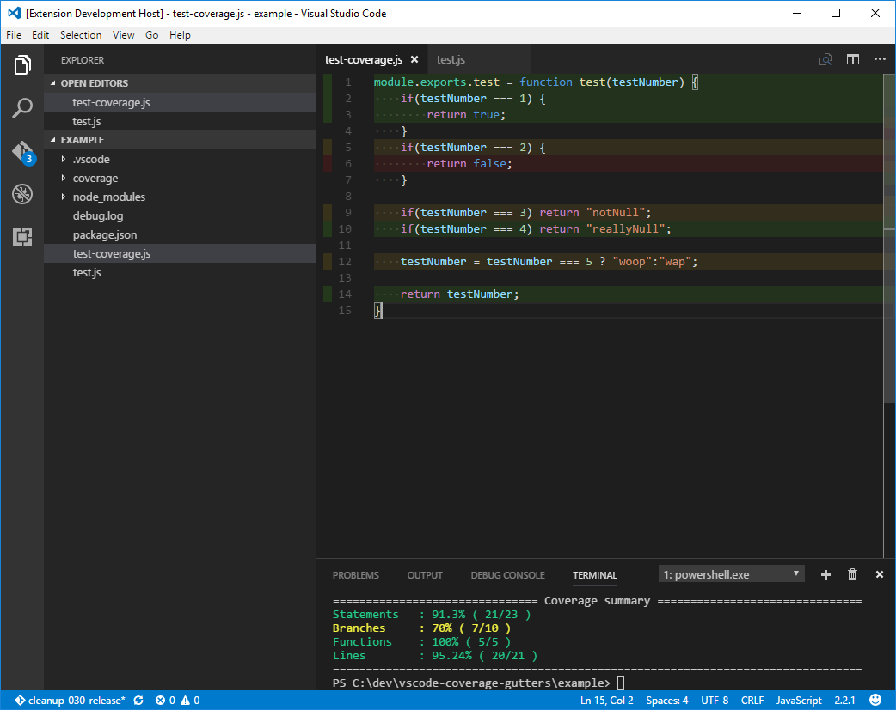

# coverage-gutters

## Features
- watch editors and lcov feature activated via status bar button or command

- lcov displayed in full, partial and uncovered options

- relative lcov file resolution option for those with complex file paths
- workspace settings to customize the features to your liking
- colour compatibility with light and dark themes

## Requirements
- vscode 1.11.x and up
- macos, linux or windows

## Extension Settings

|Setting | Description
|--------|------------
|`coverage-gutters.lcovname`|Allows specification of a custom lcov file name
|`coverage-gutters.altSfCompare`|Uses a relative method of comparing lcov source file paths (default true)
|`coverage-gutters.highlightlight`|Changes the highlight for light themes
|`coverage-gutters.highlightdark`|Changes the highlight for dark themes
|`coverage-gutters.partialHighlightLight`|Changes the partial highlight for light themes
|`coverage-gutters.partialHighlightDark`|Changes the partial highlight for dark themes
|`coverage-gutters.noHighlightLight`|Changes the uncovered highlight for light themes
|`coverage-gutters.noHighlightDark`|Changes the uncovered highlight for dark themes
|`coverage-gutters.gutterIconPathDark`|Relative path to an icon in the extension for dark themes
|`coverage-gutters.gutterIconPathLight`|Relative path to an icon in the extension for light themes
|`coverage-gutters.partialGutterIconPathDark`|Relative path to an icon (partial coverage) in the extension for dark themes
|`coverage-gutters.partialGutterIconPathLight`|Relative path to an icon (partial coverage) in the extension for light themes
|`coverage-gutters.noGutterIconPathDark`|Relative path to an icon (no coverage) in the extension for dark themes
|`coverage-gutters.noGutterIconPathLight`|Relative path to an icon (no coverage) in the extension for light themes
|`coverage-gutters.showLineCoverage`|Show or hide the line coverage
|`coverage-gutters.showRulerCoverage`|Show or hide the ruler coverage
|`coverage-gutters.showGutterCoverage`|Show or hide the gutter coverage
|`coverage-gutters.customizable.status-bar-toggler-watchLcovAndVisibleEditors-enabled`|Setting this to false will remove the status bar item
|`coverage-gutters.customizable.menus-editor-context-displayCoverage-enabled`|Setting this to false will remove the command from the editor context menu and vice versa
|`coverage-gutters.customizable.menus-editor-context-watchLcovFile-enabled`|Setting this to false will remove the command from the editor context menu and vice versa
|`coverage-gutters.customizable.menus-editor-context-watchVisibleEditors-enabled`|Setting this to false will remove the command from the editor context menu and vice versa
|`coverage-gutters.customizable.menus-editor-context-removeCoverage-enabled`|Setting this to false will remove the command from the editor context menu and vice versa
|`coverage-gutters.customizable.keybindings-displayCoverage-enabled`|Setting this to false will remove the shortcut and vice versa
|`coverage-gutters.customizable.keybindings-watchLcovFile-enabled`|Setting this to false will remove the shortcut and vice versa
|`coverage-gutters.customizable.keybindings-watchVisibleEditors-enabled`|Setting this to false will remove the shortcut and vice versa
|`coverage-gutters.customizable.keybindings-removeCoverage-enabled`|Setting this to false will remove the shortcut and vice versa

Some examples for the highlight colour are as follows:
- rgba(102, 153, 51, 0.75) <- recommended syntax based on vscode.d.ts
- keyword values like `lightred`

<a>https://developer.mozilla.org/en-US/docs/Web/CSS/CSS_Colors/Color_picker_tool</a>

<a>https://developer.mozilla.org/en/docs/Web/CSS/background-color#Syntax</a>

## Known Issues
### [Open Bugs](https://github.com/ryanluker/vscode-coverage-gutters/issues?q=is%3Aopen+is%3Aissue+label%3Abug)

## Release Notes
### [Changelog](https://github.com/ryanluker/vscode-coverage-gutters/releases)

## Contribution Guidelines
- test backed code changes
- new code matches existing style (enforced via tslint)
- bug fixes always welcome :)
- new feature proposals go through a github issue

-----------------------------------------------------------------------------------------------------------

Icon made by <a href="http://www.flaticon.com/authors/dave-gandy" title="Dave Gandy">Dave Gandy</a> from <a href="http://www.flaticon.com" title="Flaticon">www.flaticon.com</a> is licensed by <a href="http://creativecommons.org/licenses/by/3.0/" title="Creative Commons BY 3.0" target="_blank">CC 3.0 BY</a>

