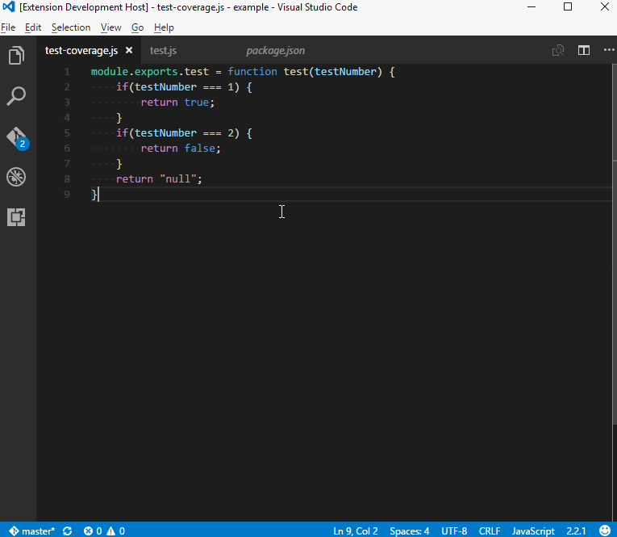

# coverage-gutters

## Features
- simple line coverage rendering using lcov
- workspace settings to change the lcov name and highlight colours
- colour compatibility with light and dark themes

## Requirements
- vscode 1.5.0 and up
- macos, linux or windows

## Extension Settings
All the settings have sane defaults but they are open to modification
- coverage-gutters.lcovname
- coverage-gutters.highlightlight
- coverage-gutters.highlightdark

Some examples for the highlight colour are as follows:
- rgba(102, 153, 51, 0.75) <- recommended syntax based on vscode.d.ts
- keyword values like `lightred`

<a>https://developer.mozilla.org/en-US/docs/Web/CSS/CSS_Colors/Color_picker_tool</a>

<a>https://developer.mozilla.org/en/docs/Web/CSS/background-color#Syntax</a>

## Known Issues
- none ( just missing functionality :) )

## Release Notes

### 0.1.0
- display and remove lcov line coverage using commands
- modify highlight colour using workspace settings
- modify lcov name using workspace settings

-----------------------------------------------------------------------------------------------------------

Icon originally made by <a href="http://www.flaticon.com/authors/dave-gandy" title="Dave Gandy">Dave Gandy</a> from <a href="http://www.flaticon.com" title="Flaticon">www.flaticon.com</a> is licensed by <a href="http://creativecommons.org/licenses/by/3.0/" title="Creative Commons BY 3.0" target="_blank">CC 3.0 BY</a>
